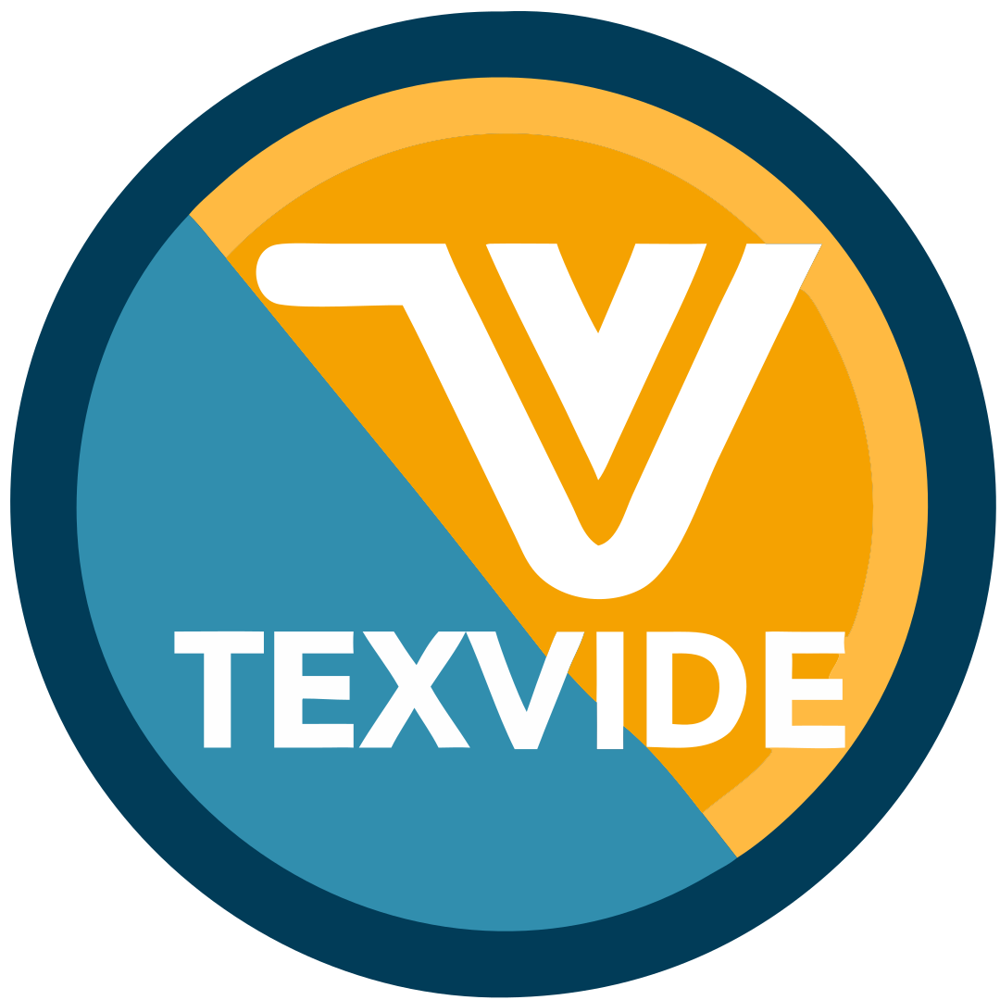

<div align="center">
  
  <h1>TexVIDE</h1>
  <p>A powerful LaTeX IDE built on Neovim with Docker integration</p>
</div>

<div align="center">
  
[](https://opensource.org/licenses/MIT)
[](https://www.linux.org/)
[](https://neovim.io/)

</div>

## 🚀 Quick Start

### Prerequisites

- Docker
- Linux operating system
- [Nerd fonts](https://www.nerdfonts.com/)

### Installation

```bash
./install_linux.sh
```

The installation script will:
1. Check for Docker installation
2. Set up the TexVIDE environment
3. Create necessary configuration files
4. Add TexVIDE to your PATH

## OSX installation (In development)

```bash
brew install python-tk xpra
```

## 📖 Documentation

- [🔑 Hotkeys Guide](docs/hotkeys.md)
- [✂️ Snippets Reference](docs/snippets.md)

## 🛠️ Configuration

TexVIDE is highly configurable through Neovim configuration files. The default configuration provides a balanced setup for LaTeX editing, but you can customize:

- Key bindings
- Snippets
- Compilation options
- PDF viewer
- Editor appearance

## 🤝 Contributing

Contributions are welcome! Feel free to:

1. Fork the repository
2. Create a feature branch
3. Submit a Pull Request

## 📝 License

This project is licensed under the MIT License - see the [LICENSE](LICENSE) file for details.

## 🙏 Acknowledgments

- [VimTeX](https://github.com/lervag/vimtex) - The core LaTeX plugin
- [UltiSnips](https://github.com/SirVer/ultisnips) - The snippet engine
- [gillescastel/latex-snippets](https://github.com/gillescastel/latex-snippets) - Inspiration for our snippet system
